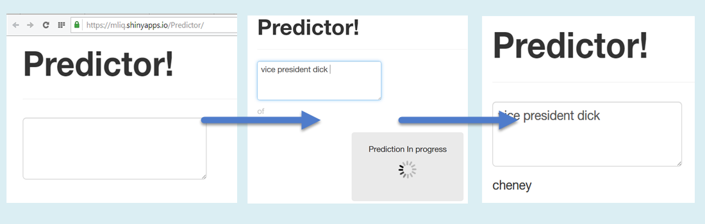

Predictor!
========================================================
author: Michael Liquori
date: December 14, 2014
Coursera / Johns Hopkins Data Science Capstone

Project Aim and Source Data
========================================================

The aim of the project is to develop a Shiny app which can predict the next word a user is typing with accuracy and speed, useful for applications such as the predictive text included with all mobile phone keyboards we are all probably familiar with, as well as third-party options such as Swiftkey.  

The algorithm is based on an n-gram model built from 3 very large corpora drawn from three different types of source material: Twitter, News, and Blogs.

A total of 4,269,678 lines consisting of 102,080,244 words were used to develop the model, provided by [HC Corpora](http://www.corpora.heliohost.org/aboutcorpus.html).

Product Overview
========================================================
Predictor! uses a visually clean and easy-to-use interface which belies the complex data crunching and algorithms working underneath.

<small>The user simply enters text into the field and waits for the predicted word to appear beneath. No button needs to be pressed, and one can also use without a mouse, simply pressing `TAB` once to reach the entry box, facilitating quick usage on any device.
  [***Click here to try the app!*** - https://mliq.shinyapps.io/Predictor/](https://mliq.shinyapps.io/Predictor/)</small>
The Algorithm
========================================================
As simplicity and accessibility were prioritized in the UI, ***speed*** has been prioritized in the algorithm. 

The final algorithm is based on a trigram model:
<small>
* Trigram frequencies have been calculated using 100% of our 3 corpora (Twitter, News, and Blogs) and combined into one frequency table
* The database was then reduced in size by cutting off all trigrams with counts less than 5

</small>
This model offered the best combination of 3 key criteria:
<small>

* **accuracy**: 15.04% on test set (drawn randomly from news, blogs, and twitter)
* **speed**: 1 sec per prediction 
* **memory size**: 9.45 MB, small enough to be easily used on a mobile device.

</small>
Conclusion
========================================================

For a live-typing application, we felt that the ~1-sec response time was crucial, and were not willing to sacrifice this for marginal improvements in accuracy.
<small>
### Next Steps
* **Accuracy could be improved with no speed/size tradeoff by offering a list of predictions, rather than just a single word, however the assignment rubric specifies to return a single prediction.**

* We were able to achieve accuracy as high as ***21.14%*** by adding classification to our algorithm, and using a larger database, however the tradeoff in speed (adding 3 to 10 seconds) made these methods unsuitable for the Shiny app. 

* **Fortunately, preliminary tests indicate speed improvements of 64% can be relatively easily attained** by paring down our database to include only the top trigram(s) for each query, but this requires significant additional CPU resources to process.

</small>
